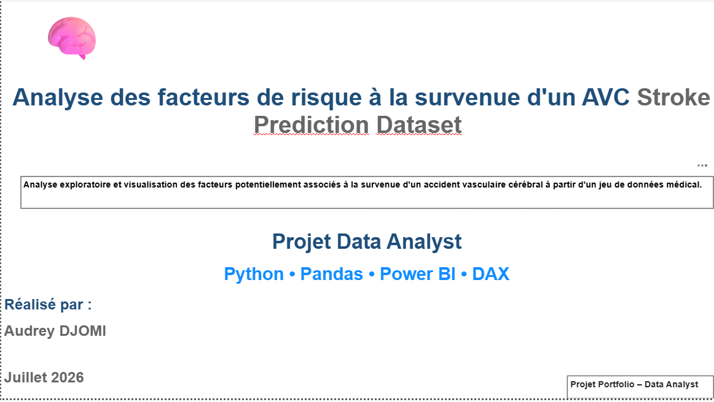
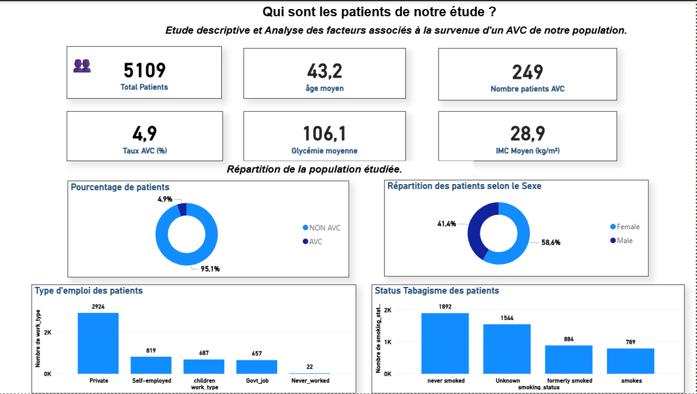
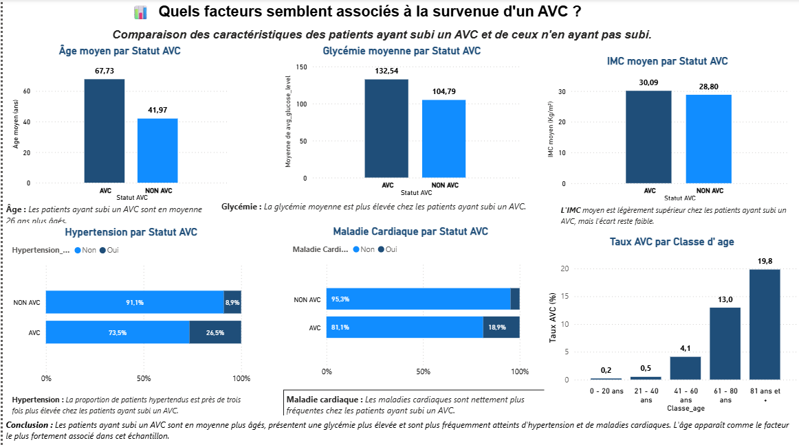
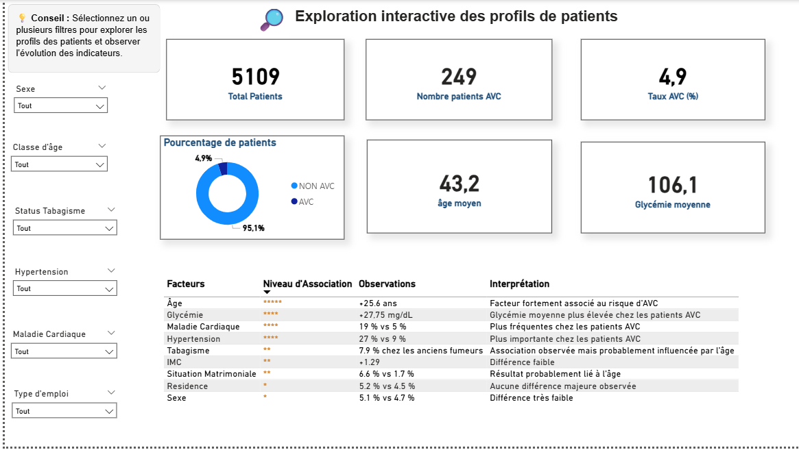

# projet-avc-prediction
Analyse des facteurs de risque associés aux AVC à partir de données médicales. 
Projet Data Analytics réalisé avec Python, Pandas, Power BI, Git et GitHub.

# Analyse des facteurs associés à la survenue d'un AVC

## Contexte

Les accidents vasculaires cérébraux (AVC) représentent l'une des principales causes de mortalité et de handicap dans le monde.

L'objectif de ce projet est d'explorer les caractéristiques médicales et démographiques des patients afin d'identifier les facteurs potentiellement associés au risque d'AVC à partir d'un jeu de données médical et de restituer les résultats à travers un dashboard Power BI.

L'analyse combine Python pour l'exploration, la préparation des données, une analyse puis Power BI pour la création d'un tableau de bord interactif destiné à faciliter l'interprétation des résultats.

## Objectifs

- Explorer et comprendre les données patients
- Nettoyer et préparer le jeu de données
- Identifier les facteurs associés à l'AVC
- Réaliser des analyses statistiques descriptives
- Construire des visualisations interactives
- Développer un dashboard Power BI

## Technologies        
### Outil                 ### Utilisation

- Python                      Analyse
- Pandas                      Manipulation
- Numpy                       Calcul
- Matplotlib                  Visualisation
- Jupiter Notebook            Développement
- Power BI                    Dashboard
- Git                         Versionning
- GitHub                      Portfolio

## Dataset

Nom : healtcare-dataset-stroke-data.csv

Nombre de patients : 5109

Nombre de variables : 11

Variable cible : stroke

## Étapes du projet

1. Importation des données

2. Exploration

3. Nettoyage

4. Analyse descriptive

5. Création d'indicateurs

6. Construction du dashboard Power BI

7. Interprétation

## Principaux résultats

Les patients ayant subi un AVC sont en moyenne plus âgés.
Une glycémie plus élevée est observée chez les patients ayant subi un AVC.
L'hypertension est nettement plus fréquente chez les patients victimes d'un AVC.
Les maladies cardiaques semblent fortement associées à la survenue d'un AVC.
Le sexe et le lieu de résidence présentent peu de différences dans cet échantillon.

⚠️ Précisons que ces résultats mettent en évidence des associations observées dans les données et ne démontrent pas une relation de cause à effet.

Dashboard

Insérer les trois captures.

Par exemple :

## Dashboard

### Page de couverture

### Vue d'ensemble

### Analyse des facteurs

### Exploration interactive

## Compétences développées

Nettoyage des données
Analyse exploratoire
Statistiques descriptives
Manipulation de données avec Pandas
Création des tables avec Pandas
Visualisation avec Power BI
Création de mesures DAX
Conception d'un tableau de bord interactif
Communication des résultats

## Auteur

Audrey DJOMI 

Data Analyst

Lien LinkedIn : https://www.linkedin.com/in/audrey-djomi-922771351/ 

Lien GitHub : https://github.com/Audrey-Djomi/projet-avc-prediction 

## Statut

✅ Projet terminé
